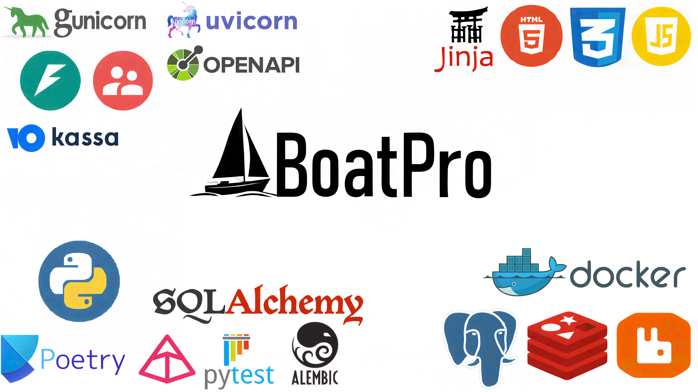

#  BoatPro
BoatPro — масштабируемое полнофункциональное e-commerce API-приложение для интернет-магазина водно-моторной техники. Позволяет быстро запустить онлайн-платформу с поддержкой товаров, заказов и пользователей. Легко адаптируется под другие категории — идеальное решение для стартапа или MVP.



## 🛠️ Технологический стек

| Компоненты | |
|----------|---:|
| **🐍 Язык:** Python 3.12+ | [](https://www.python.org/) |
| **⚡ Фреймворк:** FastAPI | [](https://fastapi.tiangolo.com/) |
| **🌐 Фронтенд:** HTML + CSS + JavaScript | [](https://developer.mozilla.org/ru/docs/Web/HTML) [](https://developer.mozilla.org/ru/docs/Web/CSS) [](https://developer.mozilla.org/ru/docs/Web/JavaScript) |
| **🚀 ASGI-сервер:** Uvicorn + Gunicorn | [](https://www.uvicorn.org/) [](https://gunicorn.org/) |
| **🗄️ База Данных:** PostgreSQL + asyncpg | [](https://www.postgresql.org/) [](https://magicstack.github.io/asyncpg/) |
| **🔁 ORM:** SQLAlchemy (async) | [](https://www.sqlalchemy.org/) |
| **🔄 Миграции БД:** Alembic | [](https://alembic.sqlalchemy.org/) |
| **🔐 Аутентификация:** FastAPI-Users | [](https://fastapi-users.github.io/fastapi-users/) |
| **✅ Валидация:** Pydantic v2 + pydantic-settings | [](https://docs.pydantic.dev/) [](https://docs.pydantic.dev/latest/concepts/pydantic_settings/) |
| **🧩 Кэширование:** Redis | [](https://redis.io/) |
| **📨 Очереди:** RabbitMQ (Pika) | [](https://www.rabbitmq.com/) [](https://pika.readthedocs.io/) |
| **📄 Шаблонизация:** Jinja2 | [](https://jinja.palletsprojects.com/) |
| **📝 Логирование:** logging | [](https://docs.python.org/3/library/logging.html) |
| **🛡️ Защита:** slowapi + CORS | [](https://slowapi.readthedocs.io/) [](https://fastapi.tiangolo.com/tutorial/cors/) |
| **💳 Оплата:** YooKassa | [](https://yookassa.ru/) |
| **📧 Почта:** aiosmtplib | [](https://aiosmtplib.readthedocs.io/) |
| **📁 Загрузка файлов:** aiofiles + python-multipart | [](https://github.com/Tinche/aiofiles) [](https://andrew-d.github.io/python-multipart/) |
| **📦 Зависимости:** Poetry | [](https://python-poetry.org/) |
| **🐳 Контейнеризация:** Docker + Docker Compose | [](https://www.docker.com/) [](https://docs.docker.com/compose/) |
| **🧪 Тестирование:** Pytest + httpx + faker | [](https://docs.pytest.org/) [](https://www.python-httpx.org/) [](https://faker.readthedocs.io/) |
| **📘 Документация:** OpenAPI (Swagger UI) | [](https://swagger.io/specification/) |

## ✅ Функционал

- **🔐 Аутентификация и безопасность**  
  > Регистрация, вход, подтверждение email, восстановление пароля.  
  > Ограничение частоты запросов (`rate limiting`) для защиты от bruteforce.  
  > `CORS` с настройкой доверенных доменов.  
  > Асинхронная отправка писем: подтверждение, сброс пароля, уведомления.
- **🛠️ Панель администратора**  
  > Полный `CRUD` для моделей: товары, категории, заказы, пользователи, пункты выдачи.
- **🗂️ Каталог товаров**  
  > Разделён на категории: лодки, подвесные моторы, прицепы.  
  > Каждый товар — с описанием, характеристиками и фото.
- **📄 Детальные страницы товаров**  
  > Полное описание, галерея изображений, кнопки `"В избранное"` и `"Купить"`.
- **🔍 Поиск товаров**  
  > Поиск по названию, бренду или описанию с поддержкой частичного совпадения.
- **🧾 Оформление заказов**  
  > Добавление товаров, выбор пункта самовывоза, оплата через `YooKassa`.  
  > Статусы: "Ожидает оплаты", "Оплачен", "Готов к выдаче", "Завершён".
- **❤️ Добавление товаров в избранное**  
  > Пользователи могут добавлять товары в избранное.
- **🔄 Миграции и суперпользователя**  
  > Автоматическое применение миграций Alembic и создание суперпользователя при старте.
- **🧩 Кэширование и фоновые задачи**  
  > Ускорение API через `Redis`. Асинхронная обработка (отправка писем).
- **📝 Логирование**  
  > Полная система логирования всех ключевых операций: аутентификация, заказы, ошибки, запросы. Готово к интеграции с ELK/Sentry.
- **🧪 Тестирование**  
  > Комплексная проверка API с помощью `Pytest`: unit-тесты, интеграционные тесты, тесты безопасности и аутентификации. Поддержка фикстур, моков и покрытия кода через `pytest-cov`.
- **📦 Контейнеризация**  
  > Полная инфраструктура: FastAPI, PostgreSQL, Redis, RabbitMQ, pgAdmin — одной командой.
- **📘 Документация API**  
  > Автогенерация по OpenAPI, доступна по `/docs`.

## 📂 Структура проекта

```bash
fastapi-application/
├── actions                    # Скрипты (создание суперпользователя)
├── alembic                    # Миграции БД 
├── api                        # Всё, что связано с HTTP API
│   ├── api_v1                 # Версия API v1
│   │   ├── dependencies       # Зависимости FastAPI
│   │   ├── routers            # Роутеры, эндпоинты (конечные точки доступа API)
│   │   ├── services           # Бизнес-логика
│   │   └── __init__.py
│   ├── webhooks               # Обработка внешних вебхуков 
│   └── __init__.py            # Регистрация роутеров API и Webhooks
├── core                       # Ядро приложения: модели, схемы, конфигурация
│   ├── dependencies           # Глобальные зависимости (get_db_session, fastapi-users)
│   ├── gunicorn               # Конфигурация Gunicorn
│   ├── models                 # ORM-модели, миксины и помощник для работы с БД
│   ├── repositories           # Операции с БД и файлами
│   ├── schemas                # Pydantic-схемы для валидации данных
│   ├── types                  # Кастомные типы (например, UserId)
│   ├── __init__.py
│   └── config.py              # Настройки приложения через pydantic-settings (.env)
├── mailing                    # Отправка email (подтверждение, сброс пароля и т.д)
├── middleware                 # Кастомные middleware 
├── static                     # Статические файлы
│   ├── css                    # Стили сайта и админ-панели
│   ├── images                 # Изображения товаров и иконки
│   └── js                     # JavaScript для форм, поиска, избранного и т.д.
├── templates                  # HTML-шаблоны (Jinja2)
├── tests                      # Автотесты Pytest (интеграционные и unit тесты)
├── utils                      # Вспомогательные утилиты
│   ├── payment                # Интеграция с YooKassa
│   ├── webhooks               # Вспомогательные функции для вебхуков
│   ├── __init__.py
│   ├── case_converter.py      # Функция конвертации имени таблицы
│   ├── key_builder.py         # Генерация ключей для кэширования в Redis
│   ├── limiter.py             # Инициализация и настройка rate limiting
│   └── templates.py           # Инициализация и настройка Jinja2Templates
├── views                      # View-функции для рендеринга HTML-страниц
├── .env                       # Переменные окружения (не отображается в git)
├── .env.template              # Шаблон .env (автоматически заменяет .env, если его нет)
├── alembic.ini                # Конфигурация Alembic
├── create_fastapi_app.py      # Создания и настройка FastAPI-приложения 
├── errors_handlers.py         # Обработчик ошибок
├── main.py                    # Точка входа: создаёт и запускает приложение
├── prestart.sh                # Скрипт, для запуска миграции перед создания БД в Docker
├── run.py                     # Запуск приложения через Gunicorn (для Docker)
└── run_main.py                # Создания и запуск приложения через Gunicorn
```

## 📸 Примеры работы приложения

### Визуал приложения
<video src="docs/media/Website-visuals.mp4" width="800" autoplay muted loop></video>

### Регистрация и Аутентификация
<video src="docs/media/Registration-Authentication.mp4" width="800" autoplay muted loop></video>

### Подтверждения почты
<video src="docs/media/Email-confirmations.mp4" width="800" autoplay muted loop></video>

### Изменения пароля
<video src="docs/media/Change-password.mp4" width="800" autoplay muted loop></video>

### Каталог и страницы с товарами
<video src="docs/media/Catalog-and-product-pages.mp4" width="800" autoplay muted loop></video>

### Адаптивность страниц
<video src="docs/media/Website-adaptability.mp4" width="800" autoplay muted loop></video>

### Покупка товара
<video src="docs/media/Buy-product.mp4" width="800" autoplay muted loop></video>

### Панель администрирования
<video src="docs/media/Admin-panel.mp4" width="800" autoplay muted loop></video>

### Создания товара
<video src="docs/media/Creation-outboard-motor.mp4" width="800" autoplay muted loop></video>

### Обновления и удаления товара
<video src="docs/media/CRUD-data.mp4" width="800" autoplay muted loop></video>
